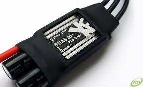

# Drone assembly
The below instructions describe how to assemble your own drone using parts provided by JAR education.
At the end, you should have a quadcopter drone that with GPS that can be programmed by a Raspberry Pi.

## General tips when assembling a drone
- Heavy items should be low. This will lower the center of mass and will help stabilize the drone.
- Distribute the weight evenly. This will keep the drone stable.
- Make sure that the propellors can spin freely. There should be no cables that the propellers can touch.
- In general, think carefully about the wiring of the system. cables should be tucked away properly so nothing can hang loose. But cables that you may want to switch regularly should be easily accessible. This also holds for the battery.
- When wiring up the system, remember that black cables are generally ground, red cables are high voltage, and white cables transmit signals. Be sure never to mix these up, or things might break.

## Drone frame
The frame of the drone consists of two pieces of acrylic, roughly in the shape of an X.
There is no difference between top and bottom, but the plastic might be slightly curved.
If so, make sure that the outer edges curve downwards.

The top and bottom pieces are connected via spacers, which can be screwed in at the small holes that are in the frame.
For a sturdy frame, use approximately twelve spacers, placed at positions that you think will result in a strong frame. 
You can test how strong your frame is by seeing if the edges bend easily (but don't bend them too much or the acrylic might snap!).

## PixHawk
At the heart of the drone is the PixHawk, a flight controller.
Its goal is to keep the drone stable, and to make it fly in the direction it is supposed to.
It does so by sending signals to each of the electronic speed controllers (ESC's) to increase/decrease thrust when necessary.
It has a lot of inputs and outputs, most of them we won't actually use.
The connectors on the top are to connect it to different pieces of equipment, such as a GPS unit.
The back of the PixHawk has a rail. These are used to output signals to the ESC's (see below) and to receive signals from an RC controller.
The top row of the rail is for ground signal (black wires), the middle row for high voltage (red wires), and the bottom row for signals (white wires).
In the sections below, we will describe which of the inputs/outputs should be connected.

The PixHawk comes with a stabilizer, which has two stages (one smaller than the other).
This should be assembled, and the PixHawk should be stuck to the smaller stage.
The stabilizer should in turn be stuck to the drone frame.

There is an arrow on the PixHawk (opposite to the rail).
It is important that this arrow is pointing to the front of the drone (as accurately as possible).

Grading tips
- Check how well the Pixhawk is pointing to the front of the drone.
- Check how well the stabilizer is constructed.

## GPS and compass
The drone comes with a GPS unit. This is used to determine the location of the drone from satellites.
The GPS has two sets of cables coming out, the red-yellow-green-black cable set should be connected to the GPS input of the drone.
The white-blue cable set should be connected to the 12C input of the drone.

The GPS is quite sensitive, and works best if there is nothing on top of it.
It is also sensitive to interference from other electronics, so try to keep it away from the PixHawk.
There may be a pole that the GPS can be placed on top of.

The GPS comes with a built-in compass. The arrow of the GPS/compass should be pointing to the front of the drone (as accurately as possible). The PixHawk also has a built-in compass, so the two must be aligned as well as possible.

## Motors and electronic speed controllers (ESC's)
The propellers of the drone are powered by motors, which in turn is connected to electronic speed controllers (ESC's).
The ESC will receive a signal to increase/decrease its thrust, which it can convert to signals that will make the motor rotate faster/slower.

Motor | ESC
--- | ---
 | 

The further the distance of the motors from the center of the drone, the more stable the drone will be.
The motors should be attached to the top plate of the drone, and should be screwed in with at least two screws.
The ESC's have three cables that are responsible for power and for signalling the amount of thrust and the direction of rotation.
The three cables each have a connector pin. Make sure that these are easily accessible, since switching any two of the three connectors will reverse the direction of rotation.

The ESC's might have a yellow-red-brown cable.
This cable is unimportant, and should be taped to the ESC to prevent it from dangling out.

The four ESC's have a black-red-white cable, which are used to receive control signals from the PixHawk. 
They should be connected to the rail at the back of the pixhawk.
A close-up of the rail is shown below, with labels for each column.
Each of the motors should be connected to a specific column on the rail.
The motor numbers are shown in the left image in the next section.
They should be connected to the corresponding column in the rail (white numbers on black background).

Grading checks:
- Are connector pins easily accessible?
- Screws of motor should be opposite of each other
- Cable exiting motor should point inwards
- All motors are connected to proper column

## Attaching propellers
To avoid the drone to start spinning wildly, two of the propellers rotate clockwise (CW), and the other two counterclockwise (CCW).
The left image below shows the direction that each of the motors should rotate.
Propellers that rotate clockwise are called Pusher propellers, and they have a different shape from propellers that rotate counterclockwise, known as Puller propellers. To find out if a propeller rotates clockwise or counterclockwise, use the right image below.

--- | ---

To attach the propellers to the motors, first remove the circular screw.
If it is too tight, use a thin piece of metal through the hole as a lever arm.
Be sure to also remove the washer.
After placing the propeller onto the motor, place the washer on top and screw tightly with the screw.

## Battery
The battery is used to power everything on the drone. This includes the ESC's (and motors), the PixHawk, and the Raspberry Pi.
It output around 11V, which can definitely produce a spark. It is therefore extremely important to always make sure that black wires are always connected to black wires, and red wires to red wires (never mix them up!).
Do not connect the battery to the rest of the system without supervision, and should not be connected unless the whole drone is completed.
The red and black wires of the battery should be connected to a power module (to connect the two, an adapter might be necessary).
The other side of the power module has three outputs on the other side: a red wire, a black wire, and a third wire that should be connected to the PixHawk power input at the bottom left.

Of the three output wires, the red and black wires should each be connected to a harness, which splits it five ways.
Four of these should go to the ESC red and black cables.
The fifth one should go to a converter, which transforms the 11V signal to a 5V signal.
This is used to power up the PixHawk rail, which powers the signals sent to the ESC's.
The 5V output should have a red and a black cable, which should be connected to the third-left column of the rail (to the right of SBUS).
Remember that the top row of the PixHawk rail is ground (black), and the middle row is +5V (red). The bottom row is signal (white) and should not be connected.

What is a good location for the battery? (center-of-mass!)

Grading tips:
- Be sure that red is always connected to red, and black to black, never have them mixed up or things will break
- Check if the cable to connect the power rail is connected properly. Should be third column from the left, and black should be at the top, red in the middle
- Battery should be in the inside of the drone, in the middle to distribute weight evenly.
- Battery should be rigid, and should not slide off when tilting the drone.
- Battery charging cable should be tucked away (not hanging loose).

## Arming button
To make sure that the drone does not accidentally fly off, there is an arming button that must first be pressed. 
It should be connected to the SWITCH port of the PixHawk.

Gradig tips
- The arming button should not hang loose.

## Buzzer
The buzzer emits a sound to signal the state of the PixHawk.
It should be connected to the BUZZER port of the PixHawk.

Grading tips
- The buzzer should not hang loose

## Raspberry Pi
The Raspberry Pi can be used to program the drone. 
It can send programming commands to the PixHawk, which will in turn control the motors.
The pins of the Raspberry Pi should be connected to the TELEM2 port of the Pixhawk (the exact connectivity will be discussed later).
The Raspberry Pi sits in a case, and should be placed close to the PixHawk.
It should be easily accessible.

## Schematic
The connections of the drone is loosely based on the schematic shown below.
However, it is important to remember that we are not using the exact same equipment, so our wiring will be different.
Nevertheless, it can serve as a guide when instructions are unclear.

## Links
- Info on ESC, motors, propellers: [http://ardupilot.org/copter/docs/connect-escs-and-motors.html]
- Info on schematic: [http://ardupilot.org/copter/docs/advanced-pixhawk-quadcopter-wiring-chart.html]
- Connecting to Raspberry Pi: [http://ardupilot.org/dev/docs/raspberry-pi-via-mavlink.html]
